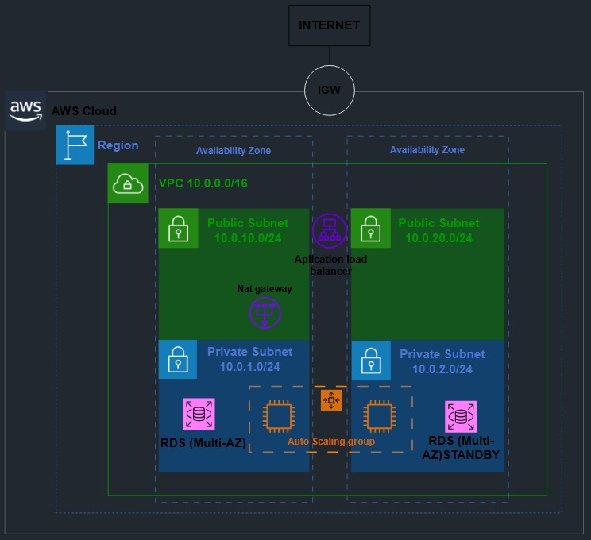

***
# Le pedi al gepeto que me aconsejara sobre como armar un readme pillo
1- Comparar las versiones en los commits y fijarse el proceso de aprendisaje en el chatgpt, adjunto link:
 
https://chatgpt.com/share/692e6983-8bc0-8008-bef7-8d15b0193323
***

# 🌩️ Obligatorio Cloud – Infraestructura en AWS usando Terraform

Este proyecto implementa la creación de toda la infraestructura necesaria para desplegar un ecommerce en PHP sobre AWS Academy, utilizando Terraform y una arquitectura modular.
Incluye redes, balanceo de carga, alta disponibilidad, base de datos administrada y seguridad por capas.
***

# 🏗️ Arquitectura Implementada

1- VPC con subredes públicas y privadas

2- Internet Gateway para salida a internet

3- NAT Gateway para que las instancias privadas puedan actualizarse

4- Application Load Balancer (ALB) público

5- Auto Scaling Group (ASG) conectado al Target Group del ALB

6- Instancias EC2 (vía ASG) con Apache + PHP mediante Launch Template

7- Base de datos MySQL en Amazon RDS

8- Security Groups con tráfico segmentado entre componentes
***

# 📁 Estructura del Proyecto

```

Obligatorio_Cloud/
│
├── main.tf
├── variables.tf
├── terraform.tfvars
│
├── modules/
│   ├── vpc/
│   │   ├── main.tf
│   │   ├── outputs.tf
│   │   ├── variables.tf
│   │   └── Docs_vpc.md
│   ├── networking/
│   ├── alb/
│   ├── security_groups/
│   ├── asg/
│   └── db/
│
└── TERRAFORM_DOCS.md

```
***

# Cada módulo contiene:

```
En main.tf : Creación y configuración

En outputs.tf : valores exportados

En variables.tf : variables del módulo

Docs_<NombreModulo>.md : Documentación generada con terraform-docs
```
***

# 🧩 Módulos desarrollados

```
El modulo "vpc" : Crea la VPC

El modulo "networking" : Crea IGW, NAT, route tables y subnets

El modulo "alb" : Crea Application Load Balancer + Target Group + Listener

El modulo "security_groups" : Crea SG del ALB, EC2 y RDS

El modulo "asg" Crea : Auto Scaling Group + Launch Template

El modulo "db" Crea : Instancia RDS MySQL
```
***

# 🚀 Despliegue de la infraestructura

Para desplegar correctamente la infraestructura:

```
1- Debés agregar las credenciales de la base de datos en terraform.tfvars (NO subidas al repositorio)
2- Configurar las credenciales de AWS en ~/.aws/credentials
```
Requisitos previos

```
1- Terraform ≥ 1.6

2- Cuenta activa de AWS Academy

3- Credenciales configuradas correctamente

4- nicializar Terraform
    terraform init

5- Aplicar la infraestructura
    terraform apply -var-file="variables.tfvars"

LISTO: Terraform generará automáticamente todos los recursos.
```
***

# 🛡️ Buenas prácticas implementadas

1- Infraestructura Modificable para un futuro cambio

2- Separación total entre configuración y credenciales

3- Security Groups específicos por componente

4- EC2 y RDS en subredes privadas

5- Alta disponibilidad mediante ALB + ASG

6- Documentación generada con terraform-docs

***

# 📊 Monitoreo con CloudWatch

## Para mejorar la disponibilidad del ecommerce se integró Amazon CloudWatch al Auto Scaling Group.

Recursos creados:

```
1- Log Group: /ecs/ecommerce-app

2- Política de escalado: scale-out-policy

3- Alarma de CPU: asg-high-cpu
```
***

# 🧠 Funcionamiento de la alarma

```
1- Métrica: CPUUtilization (AWS/EC2)

2- Condición: si la CPU supera el umbral → estado ALARM

3- Acción: ejecuta scale-out-policy, agregando una instancia EC2
```
***

## Esto permite:
```
1- Escalado automático ante picos de tráfico

2- Alta disponibilidad constante

3- Monitoreo completo desde la consola de CloudWatch
```
***

***



***